# Package Flow


## 1. Parsing — [`parse_catmap_input`](@ref)

The entry point is `parse_catmap_input(input_file_path)`, which reads a CatMAP `.mkm` template file. Because CatMAP configuration files use Python syntax, the file contents are evaluated by an embedded Python interpreter (via **PyCall.jl**). From the evaluated Python namespace the following are extracted:

| Extracted variable                | Purpose                                                                 |
|-----------------------------------|-------------------------------------------------------------------------|
| `rxn_expressions`                 | List of reaction equation strings                                       |
| `prefactor_list`                  | Arrhenius prefactors for each reaction                                  |
| `species_definitions`             | Per-species metadata (pressure, coverage, σ-params, interaction params) |
| `input_file`                      | Path to the energy table (DFT data)                                     |
| `surface_names`                   | Catalyst surface(s) (currently one surface supported)                   |
| `bulk_ph`                         | Bulk pH of the electrolyte                                              |
| `extrapolated_potential`          | Reference potential U_ref                                               |
| `potential_reference_scale`       | `"SHE"` or `"RHE"`                                                     |
| `gas_thermo_mode`                 | Gas-phase thermodynamic correction model                                |
| `adsorbate_thermo_mode`           | Adsorbate thermodynamic correction model                                |
| `electrochemical_thermo_mode`     | Electrochemical correction model                                        |
| `beta_mode`                       | BEP scaling mode for transition states (`:none`, `:simple`, `:effective_surface_charging`) |
| Adsorbate interaction parameters  | Interaction model, response function, cross-interaction modes           |

Additionally, `parameter_data.py` (bundled in the `data/` directory) is loaded at module initialization via `@pyinclude`, providing ideal gas parameters, Henry's law constants, and hydrogen-bond correction dictionaries.

### Reaction Parsing

Each reaction expression string is parsed by the internal function [`CatmapInterface.parse_reaction`](@ref), which uses regex-based parsing to decompose it into:

- **Educts** — reactant species with stoichiometric factors
- **Products** — product species with stoichiometric factors  
- **Transition state** (optional) — either an explicit activated complex or an implicit barrier specification (e.g., `^1.2eV_t`), along with a transfer coefficient β

The result is a `Vector{ParsedReaction}`.

### Energy Table Parsing

The internal function [`CatmapInterface.parse_energy_table`](@ref) reads a tab-separated file containing DFT-computed data for each species. Required columns are `surface_name`, `site_name`, `species_name`, `formation_energy` (eV), `frequencies` (cm⁻¹), and `reference`. Formation energies are converted to J/mol and frequencies to m⁻¹ (wavenumbers).

---

## 2. Species Classification — [`CatmapInterface.specieslist()`](@ref) (internal)

All species appearing in the parsed reactions are classified into one of five concrete subtypes of `AbstractSpecies`:

| Type               | Examples           | Key fields                                                                          |
|--------------------|--------------------|-------------------------------------------------------------------------------------|
| `FictiousSpecies`  | `ele_g`, `OH_g`, `H_g` | `formation_energy`, `pressure`                                                 |
| `GasSpecies`       | `CO2_g`, `CO_g`    | `formation_energy`, `pressure`, `frequencies`, `henry_const`                        |
| `AdsorbateSpecies` | `CO_t`, `COOH_t`   | `formation_energy`, `coverage`, `site`, `n_sites`, `frequencies`, `sigma_params`, `self_interaction_param`, `cross_interaction_params` |
| `TStateSpecies`    | `COOHΔeleΔH2O_t`   | `formation_energy`, `barrier`, `β`, `between_species`, `frequencies`, `sigma_params` |
| `SiteSpecies`      | `_t`               | `site_name`, `interaction_response_params`                                          |

Species are identified by regex patterns on their names (e.g., `_g` suffix → gas, `_t` suffix → site `t`). H₂_g and H₂O_g are always ensured to be present in the species list.

---

## 3. `CatmapParams` Construction

All parsed information is assembled into the central `CatmapParams` struct, which validates:

- Prefactor count matches reaction count
- All reaction species exist in the species list
- Thermo correction modes are defined functions in the module
- Beta mode and potential reference scale are valid
- Temperature is positive

---

## 4. Reaction Network Creation — [`create_reaction_network`](@ref)

This is the core computational step, converting the declarative `CatmapParams` into a symbolic `ReactionSystem` from Catalyst.jl.

### 4a. Symbolic Variable Setup

Symbolic (Symbolics.jl/ModelingToolkit) variables are created for:

- **Coverages** `θ` — one per adsorbate, with free-site coverages computed as `1 − Σθ` per site
- **Concentrations** — for gas and fictious species
- **Activity coefficients** `γ` — for gas species
- **Formation energies** `E` — symbolic parameters for transition states
- **Barriers** `Ga` and **transfer coefficients** `β` — symbolic parameters for transition states
- **Electrochemical parameters** — `σ` (surface charge), `ϕ_we` (electrode potential), `ϕ` (reaction plane potential), `local_pH`, `C_gap` (gap capacitance), `ϕ_pzc` (potential of zero charge)

### 4b. Free Energy Computation — [`CatmapInterface.compute_free_energies!`](@ref) (internal)

The Gibbs free energies of all species are computed by sequentially applying four correction stages to the raw DFT formation energies:

#### Stage 1: Adsorbate Interaction Correction
- **`ideal_adsorbate_interaction`** — no correction (default)
- **`first_order_adsorbate_interaction`** — coverage-dependent corrections using:
  - *Response functions*: `linear`, `piecewise_linear`, or `smooth_piecewise_linear`
  - *Cross-interaction modes*: `geometric_mean`, `arithmetic_mean`, or `neglect`
  - *Transition-state cross-interaction modes*: `intermediate_state`, `initial_state`, `final_state`, or `neglect`

#### Stage 2: Gas Thermo Correction
- [`CatmapInterface.ideal_gas`](@ref) (internal) — ab-initio statistical mechanics for gas molecules using the `IdealGas` model (translational + rotational + vibrational + electronic contributions to entropy and enthalpy). Molecular geometry data (atomic numbers, masses, positions) comes from the ASE g2 molecule database bundled as a Julia Artifact.

#### Stage 3: Adsorbate Thermo Correction
- [`CatmapInterface.harmonic_adsorbate`](@ref) (internal) — harmonic approximation for adsorbed species using the `HarmonicPhase` model (vibrational contributions only). For transition states without frequencies, corrections are averaged from the species they connect.

#### Stage 4: Electrochemical Correction
- [`CatmapInterface.simple_electrochemical`](@ref) (internal) — electron energy correction `−(ϕ_we − ϕ)·eV`, BEP-type corrections for transition states involving electrons, and pH corrections via the internal function [`CatmapInterface._get_echem_corrections`](@ref) (computing G_H and G_OH from G_H₂ and G_H₂O)
- [`CatmapInterface.hbond_surface_charge_density`](@ref) (internal) — extends `simple_electrochemical` with hydrogen-bond corrections and surface-charge-density-dependent corrections: `a·σ + b·σ²`

### 4c. Rate Law & Reaction Assembly

For each elementary reaction:

1. The internal function [`CatmapInterface.process_reaction_side`](@ref) computes the symbolic Gibbs free energy of the initial state (Gf_IS) and final state (Gf_FS), and assembles activity products.

2. The transition-state energy Gf_TS is determined based on the `beta_mode`:
   - **No transition state**: `max(Gf_IS, Gf_FS)`
   - **`beta_mode = :none`**: `max(Gf_IS, Gf_FS, Gf_TS_explicit)`
   - **`beta_mode = :simple`**: BEP scaling with reaction free energy `ΔG_r`
   - **`beta_mode = :effective_surface_charging`**: BEP scaling with `(ϕ_we − ϕ − ϕ_rev)`

3. Forward and reverse rates are computed using the internal function [`CatmapInterface.ratelaw_TS`](@ref):
   ```
   rate = prefactor · exp(−Gf_TS / (k_B · T)) · exp(Gf_IS / (k_B · T)) · activity_product
   ```

4. Each reaction produces a pair of `Catalyst.Reaction` objects (forward + reverse).

### 4d. Pressure Conservation (optional)

If `conserve_pressures=true`, additional compensation reactions are added for each gas and fictious species so that their net stoichiometry sums to zero — effectively making gas-phase concentrations constant.

The final result is a `complete(ReactionSystem)`.

---

## 5. Post-Processing

### [`CatmapInterface.generate_function`](@ref)

Converts the symbolic `ReactionSystem` or `ODESystem` into a fast, compiled `RuntimeGeneratedFunction`. This produces a mutating function `f!(du, u, p, t)` suitable for ODE solvers. The RHS is multiplied by −1 for compatibility with VoronoiFVM.jl conventions.

### [`liquidize`](@ref)

Transforms the gas-phase kinetic model into an aqueous-phase model by substituting gas species with liquid-phase equivalents using Henry's law:
```
c_aq = p_gas · H / (1 bar)
```
Activity coefficients are renamed accordingly (`γCO_g` → `γCO_aq`).

### [`paramsidx`](@ref)

Returns a `Dict{Symbol, Int}` mapping parameter names to their indices in the parameter vector, for convenient parameter access (e.g., `pidx[:σ]`).

---

## Module File Structure

| File                  | Responsibility                                                       |
|-----------------------|----------------------------------------------------------------------|
| `CatmapInterface.jl`  | Module definition, imports, includes, exports                        |
| `species.jl`          | `AbstractSpecies` type hierarchy and constructors                    |
| `interface.jl`        | `CatmapParams`, parsing (reactions, energy tables, species lists)    |
| `reaction_network.jl` | `create_reaction_network`, `compute_free_energies!`, `generate_function`, `liquidize`, `paramsidx` |
| `corrections.jl`      | Adsorbate interaction models, thermodynamic & electrochemical corrections |
| `ideal-gas-model.jl`  | `IdealGas` struct, entropy/enthalpy (translational, rotational, vibrational, electronic) |
| `harmonic-model.jl`   | `HarmonicPhase` struct, entropy/enthalpy (vibrational)               |
| `utils.jl`            | Atomic masses, molecule database parsing (ASE g2 artifact), template instantiation, transition-state renaming |


## Flow chart

```mermaid
flowchart TD
    subgraph INPUT["📂 Input Files"]
        MKM["CatMAP .mkm template\n(Python-syntax config)"]
        ETAB["Energy table .txt\n(TSV: species, formation energies,\nfrequencies)"]
        PYDATA["parameter_data.py\n(ideal gas params,\nHenry constants, hbond dict)"]
    end

    MKM -->|"read & eval via PyCall"| PCI
    PYDATA -->|"@pyinclude at __init__"| PCI

    PCI["parse_catmap_input()"]
    PCI -->|"extract rxn_expressions"| PR["parse_reaction()\nparse_reactant_sum()\nparse_transition_state()"]
    PR --> RXNS["Vector{ParsedReaction}\n(educts, products, tstate)"]

    PCI -->|"extract input_file path"| PET["parse_energy_table()"]
    ETAB --> PET
    PET --> ENTAB["Energy Table\n(NamedTuple rows:\nformation_energy, frequencies, …)"]

    PCI -->|"extract species_definitions,\nsurface_names, thermo modes, pH, U_ref"| SL

    RXNS --> SL
    ENTAB --> SL
    SL["specieslist()\nClassify & construct species"]

    subgraph SPECIES["🧪 Species Types (species.jl)"]
        direction LR
        GS["GasSpecies\n(formation_energy, pressure,\nfrequencies, henry_const)"]
        FS["FictiousSpecies\n(ele_g, OH_g, H_g)"]
        AS["AdsorbateSpecies\n(coverage, site, n_sites,\nfrequencies, σ-params,\ninteraction params)"]
        TS["TStateSpecies\n(barrier, β, between_species,\nfrequencies, σ-params)"]
        SS["SiteSpecies\n(site_name,\ninteraction_response_params)"]
    end

    SL --> SPECIES

    SPECIES --> CP["CatmapParams\n(reactions, prefactors, species_list,\ngas/adsorbate/echem thermo modes,\nbeta_mode, bulk_pH, U_ref, T,\nadsorbate_interaction_params)"]

    CP -->|"user calls"| CRN["create_reaction_network()"]

    subgraph SYMBOLIC["⚙️ Symbolic Setup"]
        direction TB
        SYMVARS["Define symbolic variables:\ncoverages θ, concentrations,\nactivity coefficients γ,\nformation energies E,\nbarriers Ga, β params,\nσ, ϕ_we, ϕ, local_pH, C_gap, ϕ_pzc"]
    end

    CRN --> SYMVARS
    SYMVARS --> CFE

    subgraph CFE["🔬 compute_free_energies!()"]
        direction TB
        FE0["Initialize free energies\nfrom formation energies\n(numeric or symbolic)"]
        FE0 --> AIC
        AIC["Adsorbate Interaction Correction"]
        AIC --> AIC_IDEAL["ideal_adsorbate_interaction\n(no correction)"]
        AIC --> AIC_FO["first_order_adsorbate_interaction\n(coverage-dependent,\nresponse functions,\ncross-interaction modes)"]

        AIC --> GTC["Gas Thermo Correction"]
        GTC --> GTC_IG["ideal_gas()\n→ IdealGas model\n(translational + rotational +\nvibrational + electronic\nentropy & enthalpy)"]

        GTC --> ATC["Adsorbate Thermo Correction"]
        ATC --> ATC_HA["harmonic_adsorbate()\n→ HarmonicPhase model\n(vibrational entropy & enthalpy)"]

        ATC --> ETC["Electrochemical Correction"]
        ETC --> ETC_SE["simple_electrochemical()\n(electron energy: −(ϕ_we−ϕ)·eV,\nTS BEP correction,\npH via _get_echem_corrections)"]
        ETC --> ETC_HB["hbond_surface_charge_density()\n(= simple_electrochemical\n+ hbond corrections\n+ σ-dependent: a·σ + b·σ²)"]
    end

    CFE --> RATE

    subgraph RATE["⚗️ Reaction Construction"]
        direction TB
        PROC["process_reaction_side()\n→ Gf_IS, Gf_FS, activities"]
        PROC --> GTS["Compute Gf_TS\n(transition state energy)"]
        GTS --> GTS_NONE["No TS: max(Gf_IS, Gf_FS)"]
        GTS --> GTS_BETA_NONE["beta_mode=none:\nmax(Gf_IS, Gf_FS, Gf_TS_explicit)"]
        GTS --> GTS_SIMPLE["beta_mode=simple:\nBEP with ΔG_r scaling"]
        GTS --> GTS_ESC["beta_mode=effective_surface_charging:\nBEP with (ϕ_we−ϕ−ϕ_rev)"]

        GTS --> RL["ratelaw_TS()\nprefactor · exp(−Gf_TS/kT)\n· exp(Gf_IS/kT) · activity_prod"]
        RL --> FWD_REV["Forward & Reverse\nCatalyst.Reaction pairs"]
    end

    FWD_REV --> RS["ReactionSystem\n(Catalyst.jl)"]

    RS -->|"conserve_pressures=true"| CONSERVE["Add compensation reactions\nfor gas/fictious species\n(net stoich = 0)"]
    CONSERVE --> RS_COMPLETE["complete(ReactionSystem)"]
    RS -->|"conserve_pressures=false"| RS_COMPLETE

    RS_COMPLETE -->|"user calls"| GF["generate_function()\n→ RuntimeGeneratedFunction\n(mutating RHS for ODE solver,\ncompatible with VoronoiFVM)"]

    RS_COMPLETE -->|"user calls"| LIQ["liquidize()\nConvert gas ↔ liquid\nvia Henry's law\n→ ODESystem with\naqueous species"]

    RS_COMPLETE -->|"user calls"| PIDX["paramsidx()\n→ Dict{Symbol,Int}\nparameter index map"]

    subgraph SUPPORT["📦 Support Modules"]
        direction LR
        UTILS["utils.jl\n(atomic_masses, MoleculeSpec,\nmolecule database from\nASE g2 collection artifact,\ninstantiate_catmap_template!,\nrename_tstate)"]
        IGM["ideal-gas-model.jl\n(IdealGas struct,\nentropy, enthalpy:\ntranslational, rotational,\nvibrational, electronic)"]
        HM["harmonic-model.jl\n(HarmonicPhase struct,\nentropy, enthalpy:\nvibrational only)"]
        CORR["corrections.jl\n(adsorbate interactions:\nideal / first_order,\nresponse functions:\nlinear / piecewise_linear /\nsmooth_piecewise_linear,\ncross-interaction modes,\nthermo corrections:\nideal_gas, harmonic_adsorbate,\nelectrochemical corrections)"]
    end

    style INPUT fill:#e8f4fd,stroke:#4a90d9
    style SPECIES fill:#fef3e2,stroke:#f5a623
    style SYMBOLIC fill:#f0e6ff,stroke:#9b59b6
    style CFE fill:#e8f8e8,stroke:#27ae60
    style RATE fill:#fde8e8,stroke:#e74c3c
    style SUPPORT fill:#f5f5f5,stroke:#95a5a6
```



